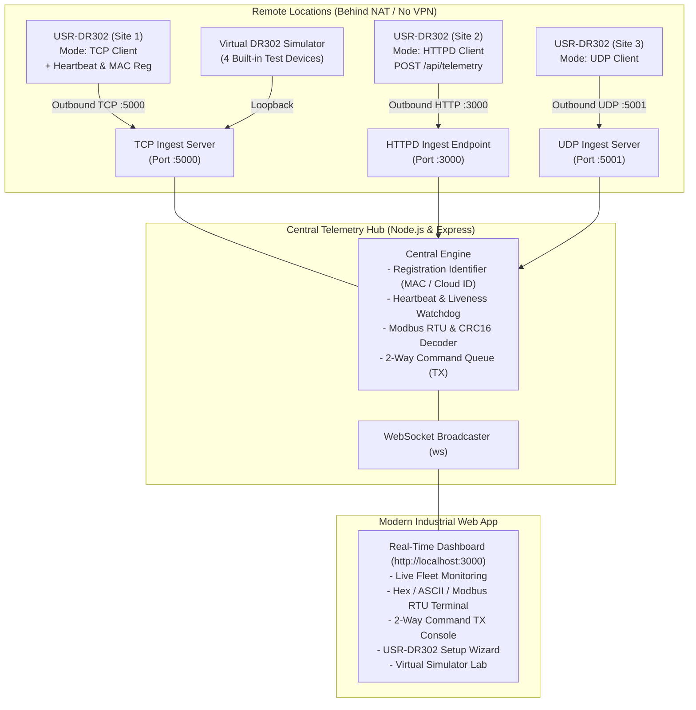

# PUSR USR-DR302 Multi-Protocol Telemetry Hub

[](https://nodejs.org/)
[](LICENSE)
[](#modbus-rtu-decoding)
[](#supported-connection-modes)

A high-performance data ingestion server and modern real-time industrial web dashboard engineered to receive telemetry from **PUSR USR-DR302** (DIN-rail RS485-to-Ethernet converters) distributed across multiple remote locations **without requiring a VPN**.

---

## The Problem Solved

When deploying serial-to-Ethernet converters (like the USR-DR302) at remote substations, solar farms, pump stations, factories, or branch sites:
- Remote sites are typically behind **NAT firewalls**, **4G/LTE cellular routers**, or **dynamic broadband IPs**.
- Inbound connections to remote sites are **blocked by default**, making traditional server-to-device polling impossible without setting up expensive, high-maintenance site-to-site VPNs or static public IPs.

### The Solution
This server acts as a centralized **listening hub** that accepts **outbound connections** initiated by remote USR-DR302 devices across the public Internet. Because connections originate from the DR302 units outbound to the central server, routers and firewalls permit the traffic automatically. 

Combined with the DR302's built-in **Heartbeat Packet** mechanism, the NAT session is held open 24/7, enabling:
1. Continuous live telemetry streaming from remote RS485 sensors.
2. Full **bidirectional communication** (sending downstream Modbus polls or serial writes directly to any remote device).
3. Universal compatibility across **TCP Client**, **HTTPD Client**, and **UDP Client** modes.

---

## Architecture Overview



---

## Key Features

- **Multi-Protocol Outbound Ingestion**:
  - **TCP Server (`:5000`)**: Handles persistent TCP client connections, parses registration packets (binary MAC or Cloud ID text), filters heartbeats, and maintains live 2-way sockets.
  - **HTTPD Client Receiver (`:3000/api/telemetry`)**: Accepts HTTP POST/GET requests generated by DR302 HTTPD mode with custom device headers.
  - **UDP Server (`:5001`)**: Receives low-latency connectionless datagrams.
- **Modbus RTU Protocol Decoding**:
  - Automatic CRC16 (`0xA001`) checksum calculation and verification.
  - Deconstructs Function Codes (`0x01`, `0x02`, `0x03`, `0x04`, `0x05`, `0x06`, `0x0F`, `0x10`).
  - Decodes raw 16-bit register values and converts 32-bit floating point metrics.
- **Bi-Directional Downstream Control (Serial TX)**:
  - Transmit Modbus RTU read/write requests, raw Hex byte sequences, or ASCII/AT commands down to any online DR302 across the WAN.
  - Live round-trip response capture and latency tracking.
- **Modern Industrial Dark UI**:
  - Real-time fleet overview with live connection indicators, packet counters, and remote IP/ports.
  - Streaming telemetry terminal with auto-scroll lock and heartbeat filtering.
  - Glassmorphic panels, neon status glows, and Google Fonts (`Inter` & `JetBrains Mono`).
- **Built-in Virtual DR302 Simulator**:
  - Built-in simulation engine featuring 4 pre-configured industrial units (Power meter, Temp/humidity sensor, Pump station, Solar inverter).
  - Test all connection modes end-to-end immediately without physical hardware.
- **Hardware Setup Wizard**:
  - Step-by-step guidance tailored to the PUSR DR302 web configuration interface.

---

## Quick Start

### Prerequisites
- [Node.js](https://nodejs.org/) v18 or higher
- npm v9 or higher

### 1. Clone & Install Dependencies
```bash
git clone https://github.com/your-username/pusr-dr302-server.git
cd pusr-dr302-server
npm install
```

### 2. Start the Server
```bash
npm start
```

### 3. Open the Dashboard
Open your browser and navigate to:
```
http://localhost:3000
```
Click **"Start Simulator"** in the top navigation bar to test live data ingestion instantly.

---

## PUSR USR-DR302 Configuration Guide

Access your physical USR-DR302 web management interface (default IP: `http://192.168.0.7`, username/password: `admin`/`admin`).

### Recommended Mode: TCP Client Mode (Best for WAN Deployments)
1. In the DR302 web console, go to **Local IP Config / Network** -> **Work Mode**.
2. Set **Work Mode** to `TCP Client`.
3. Set **Remote Server IP/Domain** to your server's public IP address, dynamic DNS hostname, or VPS IP.
4. Set **Remote Port** to `5000`.
5. Set **Local Port** to `0` (dynamic).
6. Enable **Heartbeat Packet**:
   - Time: `15s`
   - Data: `www.usr.cn` (or custom string)
   - *This keeps the NAT port mapping open continuously.*
7. Enable **Registration Packet**:
   - Mechanism: Select *“Connect with MAC”* or *“Connect with User Data”* (e.g. `DR302_SITE_A`).
   - *This allows the server to uniquely identify the unit.*
8. Under **Serial Port Settings**, match your RS485 slave device (e.g., Baud Rate `9600`, `8`, `None`, `1`).
9. Click **Save** and **Restart**.

### Alternative: HTTPD Client Mode
1. Set **Work Mode** to `HTTPD Client`.
2. Set **URL Path** to `/api/telemetry`.
3. Set **Remote Server IP/Domain** to your server's IP/domain.
4. Set **Remote Port** to `3000`.
5. Set **HTTP Header** to `X-Device-ID: DR302_BRANCH_01`.

---

## Public WAN Deployment Strategies (No VPN)

To allow remote DR302 units across the Internet to connect to your server without a VPN:

| Strategy | Ideal For | Setup Steps |
| :--- | :--- | :--- |
| **Cloud VPS** *(Recommended)* | 24/7 Production | Deploy this Node.js app on AWS EC2, DigitalOcean, Hetzner, or GCP with a static public IP. Open firewall ports `5000` (TCP), `5001` (UDP), and `3000` (HTTP). |
| **Router Port Forwarding** | On-Premise Server | Add port forwarding rules on your local broadband router: Forward ports `5000` (TCP), `5001` (UDP), and `3000` (TCP) to your server's local LAN IP. |
| **Cloudflare Tunnel / ngrok** | Testing & Development | Run `ngrok tcp 5000` or Cloudflare Tunnel to expose the TCP port publicly without opening router ports. |

---

## Configuration & Environment Variables

You can customize port numbers via environment variables:

| Variable | Default | Description |
| :--- | :--- | :--- |
| `HTTP_PORT` | `3000` | Port for the Web Dashboard and HTTPD Client ingest |
| `TCP_PORT` | `5000` | Port for USR-DR302 TCP Client inbound connections |
| `UDP_PORT` | `5001` | Port for USR-DR302 UDP Client inbound datagrams |

Example:
```bash
TCP_PORT=8234 HTTP_PORT=8080 node server.js
```

---

## REST API Reference

| Endpoint | Method | Description |
| :--- | :--- | :--- |
| `/api/telemetry` | `POST` / `GET` | Ingest endpoint for USR-DR302 HTTPD Client mode |
| `/api/devices` | `GET` | List all discovered DR302 devices, online status, and stats |
| `/api/logs` | `GET` | Retrieve recent telemetry packets (`?limit=100`) |
| `/api/send` | `POST` | Transmit serial command (Modbus poll, Hex, ASCII) to a device |
| `/api/device/alias` | `POST` | Update user-friendly device alias |
| `/api/system/network` | `GET` | Get host network interfaces and detected IP addresses |
| `/api/simulator/toggle` | `POST` | Start or stop the built-in virtual DR302 simulator |
| `/api/clear-logs` | `POST` | Clear recent in-memory packet logs |

---

## Project Structure

```
.
├── server.js            # Main application orchestrator & WebSocket broadcaster
├── tcpServer.js         # TCP socket listener, registration packet parser, keepalive handler
├── udpServer.js         # UDP datagram ingestion listener
├── httpdServer.js       # HTTP telemetry routes and REST APIs
├── deviceManager.js     # Fleet registry, watchdog timers, and event emitter
├── protocolDecoder.js   # Modbus RTU parser, CRC16 calculator, Hex & ASCII formatters
├── simulator.js         # Multi-device virtual USR-DR302 test simulator
├── public/
│   ├── index.html       # Single-page industrial dashboard layout
│   ├── style.css        # Modern dark-mode industrial styling
│   └── app.js           # Client-side WebSocket controller and UI logic
├── .gitignore           # Git ignore configuration
├── package.json         # Dependencies and scripts
└── README.md            # Documentation
```

---

## License

This project is licensed under the [MIT License](LICENSE).
